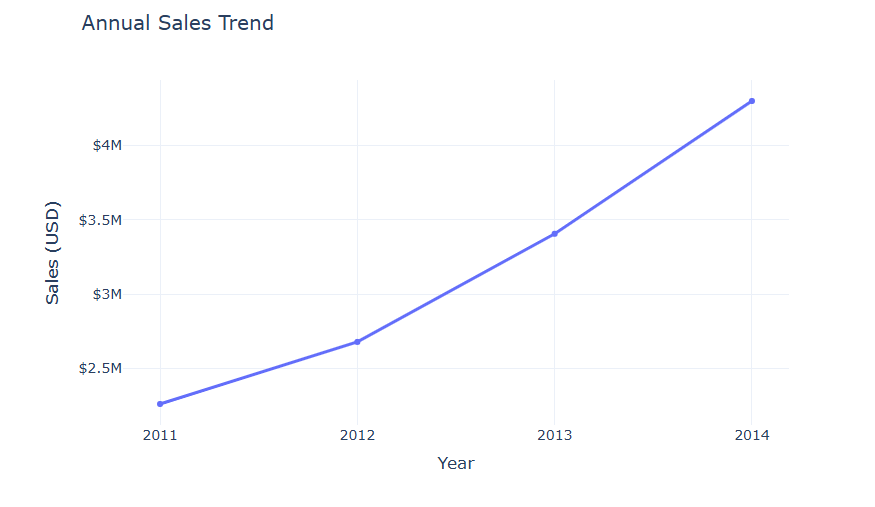
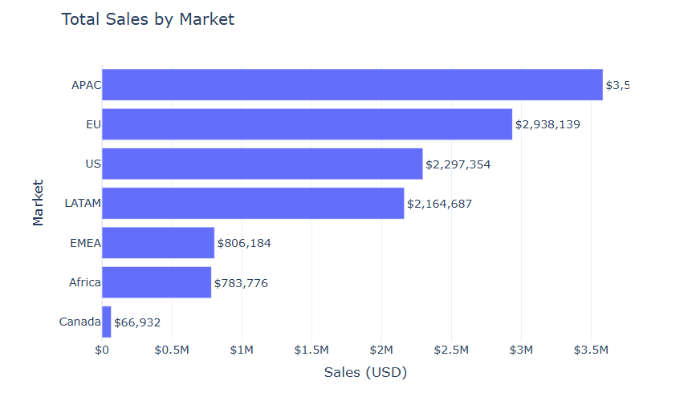
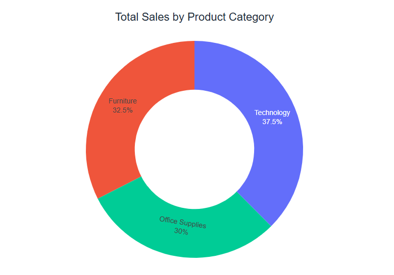
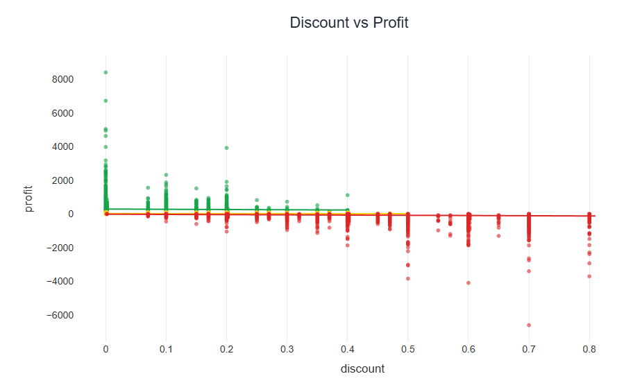

# Retail Sales Analytics with Python | Exploratory Data Analysis (EDA)


## Overview

This project presents an end-to-end Exploratory Data Analysis (EDA) of a retail sales dataset using Python. The objective is to identify sales trends, customer behavior, profitability drivers, and actionable business insights through data analysis and visualization.

---

## Kaggle Notebook

 **View the complete notebook here:**

https://www.kaggle.com/code/chuchoolver/retail-sales-analytics-dashboard-python-eda

---

##  Dashboard Preview

| Sales Trend | Sales by Market |
|----------------|--------------------|
|  |  |

| Sales by Category | Discount vs Profit |
|----------------------|-----------------------|
|  |  |

---

## Business Objectives

- Analyze sales performance over time
- Identify top-performing markets and regions
- Evaluate product category profitability
- Measure the impact of discounts on profit
- Analyze customer segments
- Evaluate shipping methods and delivery performance

---

## Tools & Technologies

- Python
- Pandas
- NumPy
- Plotly Express
- Matplotlib
- Jupyter Notebook

---

## Project Workflow

- Data Loading
- Data Cleaning
- Feature Engineering
- Exploratory Data Analysis (EDA)
- Data Visualization
- Business Insights
- Recommendations

---

## Business Questions

- How are sales evolving over time?
- Which markets generate the highest revenue?
- Which regions perform best?
- Which product categories are the most profitable?
- How do discounts affect profitability?
- Which customer segments contribute the most revenue?
- Which shipping methods are most frequently used?
- How long does delivery typically take?

---

## Repository Structure

```text
Retail-Sales-Analytics-Python/
│
├── data/
├── notebook/
├── images/
├── README.md
└── requirements.txt
```

---

## Results

The analysis identifies key sales trends, profitability drivers, customer behavior patterns, and business opportunities through interactive visualizations and data-driven insights.

---

## Author

**Jesus Olvera**

Data Analytics Portfolio Project
